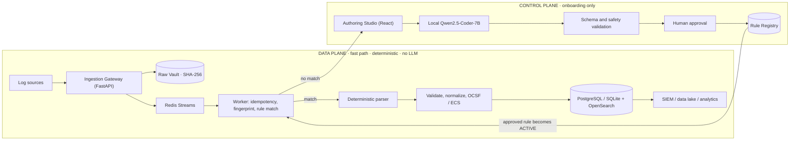

<div align="center">

# Universal Log Pre-processing Framework (ULPF)

**Different Logs. One Standard. Trusted Everywhere.**

Smart India Hackathon 2026 · Problem Statement **SIH26156** · National Technical Research Organisation (NTRO) · Theme: Blockchain & Cybersecurity · Team **S.W.O.R.D.** (Team ID 154096)

`FastAPI` · `React 18` · `PostgreSQL 15` · `Redis Streams` · `OpenSearch 2.11` · `Qwen2.5-Coder-7B (local)` · `Docker Compose` · `OCSF / ECS`

</div>

---

## Contents

1. [What is ULPF?](#1-what-is-ulpf)
2. [Architecture: Control Plane vs. Data Plane](#2-architecture-control-plane-vs-data-plane)
3. [The Rule Lifecycle](#3-the-rule-lifecycle)
4. [Normalization, Lossless Preservation and Traceability](#4-normalization-lossless-preservation-and-traceability)
5. [Running the Application](#5-running-the-application)
6. [Air-Gap Deployment Instructions](#6-air-gap-deployment-instructions)
7. [Uploading Logs via the API](#7-uploading-logs-via-the-api)
8. [Demo Workflow](#8-demo-workflow)
9. [Security Model](#9-security-model)
10. [Testing](#10-testing)
11. [Current Status and Limitations](#11-current-status-and-limitations)
12. [Future Scope and Roadmap](#12-future-scope-and-roadmap)
13. [Documentation](#13-documentation)
14. [Team](#14-team)
15. [License](#15-license)

---

## 1. What is ULPF?

Enterprise, defense and government networks generate very large volumes of log data across many vendors and proprietary formats. Before a SIEM (such as Splunk or Microsoft Sentinel) can correlate these logs for threat detection, they must be parsed and normalized.

Historically this meant engineers wrote and maintained fragile regex parsers by hand, one per source, and repaired them whenever a vendor changed a format.

**ULPF** is an adaptive, lossless, air-gapped preprocessing middleware that removes that manual step. It sits **between log shippers and the SIEM** and transforms heterogeneous raw logs into a canonical schema (OCSF or ECS), keeping the original bytes and a verifiable trail for every event.

> ULPF complements SIEM platforms; it does not replace them.

**Highlights**

| | |
|---|---|
| **Governed agentic AI** | Unrecognized formats are onboarded by a local authoring agent that drafts, self-verifies and retries a rule; a human approves it |
| **Deterministic runtime** | Live traffic is handled by versioned, approved rules only; the LLM is never on the hot path |
| **Lossless** | Raw bytes are vaulted with a SHA-256 digest *before* any transformation; unmapped fields are kept |
| **Traceable** | Every normalized event links back to its raw bytes, the rule version that produced it, and per-field provenance |
| **Air-gapped** | The model runs on local CPU/RAM through llama.cpp; nothing is sent to a cloud service |
| **Containerized** | One `docker compose` command brings up the whole stack |

---

## 2. Architecture: Control Plane vs. Data Plane

ULPF V2 keeps a strict separation between the **Data Plane** (hot path) and the **Control Plane** (authoring).



### Why the LLM is **not** in the hot path

Running a language model on every event would be slow and resource-hungry, and LLM output is non-deterministic (models can hallucinate). Security compliance needs parsing that is predictable and auditable. Therefore the Data Plane **never invokes an LLM**.

Instead, ULPF uses a **Local AI Authoring Studio** in the Control Plane. The LLM is used only when a completely new, unrecognized format is onboarded. It drafts a declarative rule, validation checks it, a human approves it, and from then on the Data Plane executes it deterministically.

> **AI assists onboarding. Deterministic code handles runtime.**
> A rule is declarative JSON (configuration), never executable code.

### The control plane is a governed, human-in-the-loop agentic workflow

The authoring agent pursues one goal (a rule that parses the samples and passes validation). It checks its own output with tools (schema and type validator, ReDoS and size safety check, golden-sample test) and retries with the validation errors as feedback, up to three times. Its autonomy is bounded: it has no tool that executes code, reads other data or calls the network; its only output is declarative JSON; and it cannot activate a rule. A human approves every rule.

### Components

| Stage | Component | Notes |
|---|---|---|
| S1 | Ingestion Gateway (`services/ingestion/gateway.py`) | Allocates a ULID `trace_id`, vaults raw bytes, enqueues; never parses |
| S1 | Raw Vault (`services/preservation/vault.py`) | Write-once filesystem store with SHA-256 digest |
| S1 | Event queue (`core/queue.py`) | Redis Streams with consumer group; in-memory fallback for local development |
| S2–S6 | Worker (`workers/processor.py`) | Idempotency check → rule lock / fingerprint → parse → validate → normalize |
| S3 | Fingerprint Engine, Rule Registry | Structural hash; versioned rules; one ACTIVE version per rule |
| S4 | ParserFactory | regex (RE2), JSONPath, CEF, LEEF, key-value, XML/XPath |
| S6 | Normalization + OCSF / ECS adapters | Masking, unmapped-field preservation, field-level provenance |
| Control | Authoring agent (`authoring/agent.py`) | Qwen2.5-Coder-7B (GGUF) via llama.cpp; mock mode for development |
| UI | React 18, Vite, TypeScript, Tailwind | Nine screens, served by FastAPI on the same origin (port 8000) |

### Technology stack (current implementation)

| Layer | Technology |
|---|---|
| Backend | Python 3.11, FastAPI, SQLAlchemy, Pydantic, Alembic |
| Frontend | React 18, Vite, TypeScript, Tailwind CSS |
| Relational data | PostgreSQL 15 (Docker) or SQLite (local development) |
| Raw evidence | Filesystem Vault (write-once, SHA-256) |
| Queue | Redis Streams + consumer group |
| Search | OpenSearch 2.11 |
| Local AI | Qwen2.5-Coder-7B-Instruct, GGUF Q4_K_M, llama.cpp |
| Deployment / CI | Docker Compose; GitHub Actions |

Kafka/Redpanda, object storage (MinIO) and ClickHouse are **scale-out roadmap targets, not part of the current build**.

---

## 3. The Rule Lifecycle

1. **Fingerprinting (fast path).** Incoming logs are hashed *structurally* by the Fingerprint Engine. If an ACTIVE rule matches the format and the target schema (for example ECS vs OCSF), the event is routed immediately, with no LLM involved.
2. **Authoring (local LLM).** Unrecognized fingerprints are routed to the Authoring Studio. The local, air-gapped Qwen model drafts a declarative parser configuration from sample events.
3. **Validation and approval.** Schema, type and safety checks run automatically. A human operator then tests the drafted rule in the React UI, edits mappings if needed, selects the target schema, and clicks **Approve & save rule**.
4. **Execution.** The approved rule becomes the ACTIVE version in the Rule Registry, and future logs of that shape are parsed deterministically at scale.

Rule states: `DRAFT → PENDING_REVIEW → ACTIVE → DEPRECATED` (also `DISABLED`, `ARCHIVED`). Every transition is written to an append-only audit trail, and the database enforces a single ACTIVE version per rule.

Details: [Rule Format Definition](Docs/ULPF_RULE_FORMAT.md) · [API Specification](Docs/ULPF_API.md) · [Local LLM Strategy](Docs/ULPF_LOCAL_LLM.md) · [Architecture Overview](Docs/ULPF_ARCHITECTURE.md)

---

## 4. Normalization, Lossless Preservation and Traceability

### OCSF / ECS canonical schema

All incoming logs are normalized to either the **Open Cybersecurity Schema Framework (OCSF)** or the **Elastic Common Schema (ECS)**, depending on the rule configuration. Whether a log came from a Cisco firewall or a Palo Alto firewall, SIEM queries stay identical.

### Lossless preservation ("zero data loss" design goal)

- **Unmapped fields are kept.** If a vendor log contains a custom field that does not map to the canonical schema, ULPF does not drop it. It is written to a clearly labelled `unmapped_fields` namespace, grouped by source.
- **Write-before-transform vault.** Before any transformation, the original raw bytes are stored and hashed with SHA-256.
- **Fail visibly.** Events that fail parsing or validation become dead-letter records with a diagnostic; the raw bytes stay in the vault.

### Traceability

Because of the vault, every normalized event can be traced to its original raw payload. The event carries a `trace_id` and a `raw_reference` (digest); the trace links to the rule ID, version and hash; and per-field provenance records show how each output field was derived. Recomputing the digest of the stored raw file reveals any later modification, which supports evidence-integrity reviews and audits.

---

## 5. Running the Application

ULPF can be run three ways: **locally** (development), with **Docker** (recommended for demo and production-style use), and **air-gapped** (secure networks, see [Section 6](#6-air-gap-deployment-instructions)).

### Configuration reference

| Variable | Meaning |
|---|---|
| `ULPF_MOCK_LLM` | `true` uses a deterministic mock instead of the model (no GPU or model file needed); `false` uses the real model |
| `ULPF_MODEL_PATH` | Path of the GGUF model file as seen by the application (for example `/models/qwen.gguf`) |
| `ULPF_MODE` | Deployment mode (for example `airgap`); see `backend/app/core/config.py` |
| `POSTGRES_USER`, `POSTGRES_PASSWORD` | PostgreSQL credentials |
| `OPENSEARCH_INITIAL_ADMIN_PASSWORD` | OpenSearch admin password |
| `ADMIN_USERNAME`, `ADMIN_PASSWORD` | Initial ULPF administrator |
| `QUEUE_BACKEND` | `memory` selects the in-process queue; otherwise Redis Streams |
| `VAULT_DIR` | Root directory of the raw-evidence vault |
| `MASK_HMAC_KEY` | Secret key for HMAC-SHA256 field masking |
| `REGEX_TIMEOUT_SECONDS` | Timeout (default 2.0 s) for the subprocess regex fallback |

Confirm exact names and defaults in `backend/app/core/config.py` and `backend/.env.example`.

### Option A: Run locally (development)

ULPF runs as one unified application on a single origin, `http://localhost:8000`, with a 16:9 React dashboard.

**Prerequisites:** Node.js 18+ (CI uses Node 20), Python 3.11+, Docker.

```bash
# 1. Start infrastructure (PostgreSQL, Redis, OpenSearch)
docker compose up -d postgres redis opensearch

# 2. Build the frontend
cd frontend
npm install
npm run build
cd ..

# 3. Set up the Python environment
cd backend
python -m venv venv
source venv/bin/activate          # Windows: venv\Scripts\activate
pip install -r requirements.txt

# 4. Configure the environment
cp .env.example .env              # Windows CMD: copy .env.example .env
# The default .env configures a local PostgreSQL database and the in-memory queue.

# 5. Create the schema and start the backend
alembic upgrade head
uvicorn app.main:app --host 127.0.0.1 --port 8000 --reload
```

On Windows, `.\start_local.ps1` (run from the repository root) compiles the frontend and serves it through the backend at `http://localhost:8000`.

To try the LLM Studio **without a GPU or model file**, set `ULPF_MOCK_LLM=true` in `backend/.env`.

**Troubleshooting database / Alembic errors**

If `alembic upgrade head` fails with `psycopg2` or foreign-key errors, you may have stale Docker volumes from an earlier version. Reset the PostgreSQL schema:

> **Warning: this permanently deletes all data in the `ulpf` database. Development use only.**

```bash
docker exec ulpf-postgres-1 psql -U ulpf -d ulpf -c "DROP SCHEMA public CASCADE; CREATE SCHEMA public;"
alembic upgrade head
```

The container name may differ on your machine (check `docker ps`).

### Option B: Run through Docker

For the complete stack (PostgreSQL, Redis, OpenSearch and ULPF), Docker is the recommended approach.

```bash
# 1. Configure the environment
cd backend
cp .env.example .env
# Update passwords and settings in .env
cd ..

# 2. Start the full stack from the repository root
docker compose up --build -d
```

Open **http://localhost:8000** (API documentation at `http://localhost:8000/docs`).

### Option C: Run air-gapped

For secure, offline environments with no internet connectivity, follow [Section 6](#6-air-gap-deployment-instructions).

---

## 6. Air-Gap Deployment Instructions

ULPF is built for defense and regulated networks that allow no outbound internet connectivity. It runs the quantized `qwen2.5-coder` model entirely on the local CPU/RAM through llama.cpp, so no log data leaves the network.

Steps 1–3 happen on an **internet-connected machine**; steps 4–5 on the **isolated target machine**.

**Step 1. Fetch the model (connected machine).** Download `qwen2.5-coder-7b-instruct-q4_k_m.gguf` from Hugging Face and place it in a `models/` directory at the project root:

```bash
mkdir -p models
cp /path/to/qwen2.5-coder-7b-instruct-q4_k_m.gguf ./models/qwen.gguf
```

**Step 2. Build and export (connected machine).** Build the application and package all dependencies into a tarball:

```bash
./airgap/export_bundle.sh
# Windows: .\airgap\export_bundle.ps1
```

**Step 3. Transfer.** Copy the entire ULPF directory (now containing `airgap/ulpf-airgap-bundle.tar` and `airgap/manifest.sha256`) to secure removable media and carry it to the isolated machine. Verify the checksums against `manifest.sha256` after copying.

**Step 4. Configure (isolated machine).** Create a `.env` file in the project root:

```dotenv
# Use the real model instead of mock mode
ULPF_MOCK_LLM=false
ULPF_MODEL_PATH=/models/qwen.gguf

# Standard settings
ULPF_MODE=airgap
POSTGRES_USER=ulpf
POSTGRES_PASSWORD=<secure_password>
OPENSEARCH_INITIAL_ADMIN_PASSWORD=<secure_password>
ADMIN_USERNAME=admin
ADMIN_PASSWORD=<secure_password>
```

Make sure `docker-compose.yml` mounts `./models` at `/models` in the application container so that `ULPF_MODEL_PATH` resolves.

**Step 5. Import and start (isolated machine).** Load the images and start the stack:

```bash
./airgap/import_bundle.sh
# Windows: .\airgap\import_bundle.ps1
```

---

## 7. Uploading Logs via the API

Logs can be ingested with **API keys generated from the UI** (API Keys screen). The base path is `/api/v1`; the interactive OpenAPI documentation is at `http://localhost:8000/docs`.

### Method A: upload a batch file (CSV, JSONL or TXT)

The Jobs endpoint accepts `multipart/form-data` uploads:

```bash
curl -X POST "http://127.0.0.1:8000/api/v1/jobs?source_id=paloalto" \
  -H "Authorization: Bearer YOUR_API_KEY" \
  -F "file=@/path/to/your/logs.txt"
```

### Method B: stream batches (JSON array)

If an agent streams logs, create a session and push batches of string payloads:

```bash
# 1. Create a session
curl -X POST "http://127.0.0.1:8000/api/v1/sessions" \
  -H "Content-Type: application/json" \
  -H "Authorization: Bearer YOUR_API_KEY" \
  -d '{"source_id": "paloalto"}'
# Example response: {"id": "session-uuid-123", "status": "ACTIVE"}

# 2. Push a batch of logs to that session
curl -X POST "http://127.0.0.1:8000/api/v1/sessions/session-uuid-123/events" \
  -H "Content-Type: application/json" \
  -H "Authorization: Bearer YOUR_API_KEY" \
  -d '["<14>1 2026-09... log data 1", "<14>1 2026-09... log data 2"]'
```

### Endpoint overview

| Group | Endpoints |
|---|---|
| Onboarding | `POST /onboarding/{session_id}/samples`, `/draft`, `/validate`, `/approve` |
| Ingestion | `POST /sessions`, `POST /sessions/{session_id}/events`, `POST /jobs?source_id=`, `POST /convert` |
| Rules | `GET /rules`, `GET /rules/{rule_id}` |
| Events / trace | `GET /events`, `GET /events/{trace_id}` (raw reference, parsed result, digest) |
| Sources | `GET /sources`, `POST /sources` |

**Authentication:** HMAC-signed bearer token (1-hour expiry) or HTTP Basic; source-scoped API keys for shippers. Roles: `viewer` < `approver` < `administrator`. Approving a rule requires at least `approver`.

---

## 8. Demo Workflow

To showcase the separation of the data plane and control plane, the 16:9 dashboard views and Studio onboarding, read the **Ideal Demo Workflow** ([`Docs/ULPF_DEMO.md`](Docs/ULPF_DEMO.md), script in [`Docs/ULPF_DEMO_SCRIPT.md`](Docs/ULPF_DEMO_SCRIPT.md)). A short version:

1. Show three heterogeneous logs (Syslog, JSON, CEF).
2. In the Studio, submit an unknown proprietary sample; it is flagged as an unrecognized fingerprint and the local model drafts a rule.
3. Show validation results, edit mappings, choose OCSF or ECS, and approve.
4. Convert a single log and show the raw object, its SHA-256 digest and the normalized event with rule ID, version and hash.
5. Run a batch job or session: after about ten validated events the rule locks and the fast path takes over.
6. Inject a changed-format event mid-session to show a spot-check flag without failing the session.
7. Open **Events** to search normalized data across vendors, with the raw evidence one click away.

---

## 9. Security Model

- **No outbound model calls:** llama.cpp loads a local `.gguf` file and runs on CPU/RAM.
- **Rules are data, not code:** declarative JSON with a size cap and static ReDoS-pattern rejection; no field can hold a script, SQL, URL or credential.
- **Prompt-injection resistance:** samples are treated as untrusted data, the model can only return JSON, validation re-checks it independently, and a human must approve every rule.
- **ReDoS-safe execution:** RE2 when available, otherwise a killable subprocess with a hard timeout.
- **Access control:** bearer or Basic authentication, ordered roles, source-scoped API keys stored hashed, rate limiting.
- **Field masking:** per-field `hash` (HMAC-SHA256), `mask` or `drop`.
- **Evidence integrity:** write-once vault plus SHA-256 digest; a modified raw file fails verification.

TLS termination and secret management (strong `MASK_HMAC_KEY`, token-signing secret, admin passwords) are deployment responsibilities.

---

## 10. Testing

Backend tests use `pytest`:

```bash
cd backend
pytest tests/ -v
```

The suite has 24 test files covering parsers, validation, normalization and masking, vault write-once semantics and digest tamper detection, the rule lifecycle and rule-lock state machine, safety and security regressions, authentication and API keys, queue behaviour, air-gap operation, and an end-to-end pipeline test. GitHub Actions runs the suite against a real `postgres:15` service on every push and pull request, and builds the frontend with Node 20.

### Observed performance (demonstration run)

One run on a development laptop (Windows, `uvicorn --reload`, in-memory queue, PostgreSQL / Redis / OpenSearch in Docker, mock LLM). This is a baseline, not a benchmark.

| Measure | Observation |
|---|---|
| Batch job | 2,000 events completed in about 165 s (about 12 events/s end to end, about 82 ms per event, including database and OpenSearch writes) |
| Rule lock | Locked at event 11; 1,989 of 2,000 events (99.45%) took the fast path |
| Dashboard totals | 2,838 ingested and normalized; 8 through adaptive discovery, 2,830 through the fast path; 0 dead letters |

Formal latency (p50/p95/p99) and throughput benchmarks are still to be run. Use the supplied script (standard library only):

```bash
python ulpf_benchmark.py --url http://127.0.0.1:8000/api/v1/convert \
  --token YOUR_API_KEY --events sample_events.txt \
  --body-template '{"payload": "{{EVENT}}"}' --n 2000 --warmup 100 --concurrency 4
```

Adapt the body template to the schema at `/docs`, and report the machine, queue backend, worker count and LLM mode with the result.

---

## 11. Current Status and Limitations

ULPF V2 is a functional prototype of the full pipeline. Against the eleven capabilities requested in SIH26156, nine are met and two are partially met (unified cross-source visibility, and a worked analytics/ML workflow).

- **Horizontal scaling.** The current `docker-compose.yml` runs a single-node pipeline suitable for demonstration and pilots. Multi-node scale-out means replacing Redis Streams with a distributed streaming backbone (Kafka/Redpanda, roadmap F1).
- **CPU inference.** Onboarding runs on the CPU. This is sufficient for discovery, but heavy backfilling of historical data through the adaptive path may cause latency spikes.
- **Encrypted or binary logs** are out of scope.
- **Unoptimized throughput.** The demonstration run gave about 12 events/s end to end on a development setup; no tuning, bulk writes or multi-worker scaling has been measured.
- **Not formally benchmarked.** Latency percentiles, parsing accuracy on a labelled corpus, and draft quality of the 7B model have not been measured, and no such figures are claimed.

---

## 12. Future Scope and Roadmap

| # | Enhancement | Impact | Planned implementation |
|---|---|---|---|
| F1 | Distributed event queue (Kafka / Redpanda) | High | Redis Streams is the current queue (with an in-memory fallback for development). Add a Kafka/Redpanda backend behind the existing queue protocol for distributed persistence across clustered Data Plane nodes, and benchmark it against Redis Streams |
| F2 | Full semantic enrichment | Medium | The normalization adapters map structural fields to OCSF/ECS. Next: enrich data, for example resolve `activity_id` integer codes and `category_uid` lookup tables |
| F3 | Multi-tenant architecture | High | Currently optimized for a single enterprise. Introduce PostgreSQL Row-Level Security and `tenant_id` namespaces to support Managed Security Service Providers (MSSPs) |
| F4 | Persistent WebSocket streaming | Low | Events are processed in micro-batches (`POST /sessions/{id}/events`). Add bidirectional WebSocket and Server-Sent Events endpoints for persistent stream connections |
| F5 | Role-based access control | Medium | Currently three ordered roles. Build a user-management UI with granular roles (Rule Author, Rule Approver, Read-Only Analyst) |
| F6 | Rust ingestion producer | Medium | The Ingestion Gateway is the queue producer (vault write, then publish) and workers are consumers. A Rust (Tokio) producer, as a service or PyO3 module, could raise async ingest throughput. Benchmark it against the current FastAPI producer before adopting it |

Further planned work: supervised distillation of a smaller local model from reviewer-approved edits, rule-package export/import between air-gapped sites, and Kubernetes deployment.

---

## 13. Documentation

| Document | Location |
|---|---|
| Architecture Overview | [`Docs/ULPF_ARCHITECTURE.md`](Docs/ULPF_ARCHITECTURE.md) |
| API Specification | [`Docs/ULPF_API.md`](Docs/ULPF_API.md) |
| Rule Format Definition | [`Docs/ULPF_RULE_FORMAT.md`](Docs/ULPF_RULE_FORMAT.md) |
| Local LLM Strategy | [`Docs/ULPF_LOCAL_LLM.md`](Docs/ULPF_LOCAL_LLM.md) |
| Explainer and demo guide | [`Docs/ULPF_EXPLAINER.md`](Docs/ULPF_EXPLAINER.md), [`Docs/ULPF_DEMO.md`](Docs/ULPF_DEMO.md) |

The project report, architecture document, technical documentation and research study accompany the SIH submission.

---

## 14. Team

**Team S.W.O.R.D.** (Secure · Unify · Process · Fortify)

| Member | Role |
|---|---|
| Divyansh Rajat | Team Leader and Solution Architect |
| Ashish Bhardwaj | Cybersecurity Engineer |
| Sakshi | AI/ML and Rule Authoring Agent |
| Parampreet Kaur | Backend Developer |
| Aryan Jeet | Frontend and User Experience |
| Saksham | Testing, Quality and Documentation |

---

## 15. License

Developed by Team S.W.O.R.D. for the Smart India Hackathon 2026 (SIH26156). No open-source license has been selected yet; add a `LICENSE` file before allowing reuse or redistribution.
